\# OpsOS 


# OpsOS

**OpsOS — Intelligent Operations System**

An AI-powered operations platform designed to monitor systems, understand operational events, investigate incidents, recommend authorised actions, and eventually execute those actions through controlled tools.

OpsOS is being built incrementally and publicly, one engineering milestone at a time.

> **Observe → Understand → Investigate → Recommend → Approve → Execute → Verify → Audit**

The project originally began as **CareerOS**, a career-operations platform. The project has since been deliberately pivoted into OpsOS. The repository retains its historical `careeros` name for now, but the active product and architecture are OpsOS.

<p align="center">

  
&#x20; 

</p>


<p align="center">

&#x20; <strong>Intelligent Operations System</strong><br>

&#x20; Observe systems. Understand incidents. Recommend actions. Execute safely.

</p>


<p align="center">

&#x20; 

&#x20; 

&#x20; 

&#x20; 

&#x20; 

</p>


\---


\## What is OpsOS?


\*\*OpsOS\*\* is an intelligent operations platform designed to observe technical systems, understand operational events, investigate incidents, recommend controlled responses, and eventually execute authorised actions through explicit operational tools.


The project is intentionally built from the operational foundations upward.


It is \*\*not just a chatbot\*\*.


It is \*\*not just a monitoring dashboard\*\*.


It is \*\*not an automation script with an LLM attached\*\*.


The goal is to build an operational system that can reason from observable evidence while keeping potentially consequential actions controlled, reviewable, and auditable.


\---


\## The Operational Loop


```mermaid

flowchart LR

&#x20;   A\[Systems] --> B\[Events]

&#x20;   B --> C\[Incidents]

&#x20;   C --> D\[Investigation]

&#x20;   D --> E\[Recommendation]

&#x20;   E --> F\[Approval]

&#x20;   F --> G\[Execution]

&#x20;   G --> H\[Verification]

&#x20;   H --> I\[Audit]

&#x20;   I -. feedback .-> A

```


The long-term system follows a simple principle:


> \*\*Observe → Understand → Recommend → Authorise → Execute → Verify → Audit\*\*


Each stage exists for a reason.


Operational automation should not jump directly from a noisy system event to a consequential action.


\---


\## Why OpsOS?


Real technical operations involve more than detecting that something is wrong.


A useful operations system needs to answer questions such as:


\* What happened?

\* Which service is affected?

\* What evidence supports the incident?

\* How severe is it?

\* What should happen next?

\* Does that action require approval?

\* Was the action actually executed?

\* Did the system recover?

\* What happened afterwards?


OpsOS is being developed around that complete lifecycle.


The project therefore prioritises \*\*deterministic operational behaviour first\*\*, with intelligent and AI-assisted capabilities introduced only where they can operate safely on top of those foundations.


\---


\# Current Architecture


```mermaid

flowchart TB

&#x20;   Systems\["External / Managed Systems"]


&#x20;   Systems --> Events\["Event Ingestion"]


&#x20;   Events --> Evaluator\["Deterministic Event Evaluator"]


&#x20;   Evaluator --> Incident\["Incident Management"]


&#x20;   Incident --> Investigation\["Incident Investigation"]


&#x20;   Investigation --> Recommendation\["Action Recommendation"]


&#x20;   Recommendation --> Approval\["Approval Gate"]


&#x20;   Approval --> Execution\["Controlled Action Execution"]


&#x20;   Execution --> Verification\["Operational Verification"]


&#x20;   Verification --> Audit\["Audit Trail"]


&#x20;   API\["FastAPI"] --> Events

&#x20;   API --> Incident

&#x20;   API --> Investigation

&#x20;   API --> Recommendation

&#x20;   API --> Approval

&#x20;   API --> Execution


&#x20;   DB\[("PostgreSQL")]

&#x20;   API --> DB


&#x20;   Redis\[("Redis")]

&#x20;   API --> Redis

```


The current implementation is deliberately backend-first.


The frontend, external infrastructure integrations, and AI-assisted operational reasoning come later, after the underlying operational model is reliable.


\---


\# Milestone Progress


| Milestone                                    | Status                         |

| -------------------------------------------- | ------------------------------ |

| 0–7                                          | Historical CareerOS foundation |

| \*\*8 — Operational Backend Foundation\*\*       | ✅ Complete                     |

| \*\*9 — Event → Incident Intelligence\*\*        | ✅ Complete                     |

| \*\*10 — Incident Investigation\*\*              | ✅ Complete                     |

| \*\*11 — Deterministic Action Recommendation\*\* | ✅ Complete                     |

| \*\*12 — Approval-Gated Action Execution\*\*     | 🚧 Next                        |

| 13 — Verification \& Operational Feedback     | 📋 Planned                     |

| 14 — Intelligent Operations Layer            | 📋 Planned                     |


> Milestones 0–7 belong to the project's original CareerOS phase. From Milestone 8 onward, the system was deliberately pivoted into \*\*OpsOS\*\*.


\---


\## Milestone 8 — Operational Backend Foundation


Milestone 8 established the core operational domain.


\### Core entities


\* Service

\* Event

\* Incident

\* Action

\* Approval

\* Audit Log


\### Backend foundations


\* FastAPI API

\* PostgreSQL persistence

\* SQLAlchemy repositories

\* Application services

\* API routes

\* Database migrations

\* Integration testing against real PostgreSQL


This milestone established the operational data model that later milestones build upon.


\---


\## Milestone 9 — Event → Incident Intelligence


OpsOS can evaluate incoming events deterministically.


The system considers structured evidence such as:


\* event severity

\* event type

\* incident severity

\* existing active incidents


Examples:


```text

CRITICAL event

&#x20;     ↓

problematic event

&#x20;     ↓

create or reuse active incident

&#x20;     ↓

associate event with incident

```


The evaluator records \*\*why\*\* an event was considered problematic rather than simply producing an unexplained boolean decision.


The system can also escalate an existing incident when stronger evidence arrives.


No LLM is required for this behaviour.


\---


\## Milestone 10 — Incident Investigation


OpsOS can investigate an incident using its associated operational evidence.


The investigation endpoint is:


```text

GET /api/v1/incidents/{incident\_id}/investigation

```


It returns:


\* incident information

\* affected service

\* associated events

\* event count

\* deterministic findings

\* investigation ordering metadata


The system explicitly distinguishes event ordering from actual chronology.


Where timestamps are unavailable, OpsOS does \*\*not\*\* pretend that database ordering represents real-world time.


```json

{

&#x20; "ordering": {

&#x20;   "basis": "event\_id",

&#x20;   "chronology\_available": false

&#x20; }

}

```


This reflects an important design principle:


> \*\*The system should distinguish what it knows from what it assumes.\*\*


\---


\## Milestone 11 — Deterministic Action Recommendation


OpsOS can now turn an investigated incident into a structured recommendation.


```text

Incident

&#x20;  ↓

Investigation

&#x20;  ↓

Recommendation

```


Endpoint:


```text

GET /api/v1/incidents/{incident\_id}/recommendation

```


A recommendation contains:


\* action type

\* reason

\* confidence

\* approval requirement

\* supporting evidence


For example:


```json

{

&#x20; "recommendation": {

&#x20;   "action\_type": "restart\_service",

&#x20;   "reason": "Critical incident affecting a degraded service with critical event evidence.",

&#x20;   "confidence": "deterministic",

&#x20;   "requires\_approval": true

&#x20; }

}

```


Current recommendation logic is intentionally constrained.


Supported action concepts already present in the domain include:


```text

restart\_service

scale\_service

rollback\_deployment

acknowledge\_incident

```


The recommendation engine does \*\*not\*\* execute the action.


It also does not create an Action or Approval record merely because a recommendation exists.


That separation is intentional.


\---


\# Milestone 12 — Approval-Gated Execution


The next stage is to connect recommendations to controlled execution.


The intended flow is:


```text

Recommendation

&#x20;     ↓

Create Action

&#x20;     ↓

Create Approval

&#x20;     ↓

Human / authorised system approves

&#x20;     ↓

Execute controlled action

&#x20;     ↓

Verify result

&#x20;     ↓

Write audit information

```


The safety rules are deliberately strict:


\* recommendations do not execute automatically

\* rejected actions cannot execute

\* only approved actions can execute

\* arbitrary shell execution is not permitted

\* destructive infrastructure operations are not introduced casually

\* action types remain explicitly controlled

\* execution is isolated behind an action interface/adapter


The goal is to establish the \*\*authorisation boundary\*\* before introducing real infrastructure operations.


\---


\# Design Principles


\### 1. Deterministic foundations first


Operational behaviour should be understandable and testable before AI is introduced.


\### 2. Evidence over assumptions


Every investigation and recommendation should be grounded in observable system data.


\### 3. Explicit uncertainty


If the system does not have enough information to establish chronology or causality, it should say so.


\### 4. Recommendation ≠ execution


Suggesting an action and performing an action are separate responsibilities.


\### 5. Approval before consequence


Potentially consequential operations require an explicit authorisation boundary.


\### 6. Controlled tools


OpsOS should eventually execute actions through well-defined operational adapters rather than arbitrary commands.


\### 7. Auditability


Operational decisions should leave enough information behind to understand what happened and why.


\### 8. AI as an operational capability


The eventual AI layer should enhance investigation, reasoning, and decision support rather than replace the operational safety model.


\---


\# Technology


| Layer                        | Technology                      |

| ---------------------------- | ------------------------------- |

| API                          | FastAPI                         |

| Language                     | Python                          |

| Database                     | PostgreSQL                      |

| ORM                          | SQLAlchemy                      |

| Cache / messaging foundation | Redis                           |

| Migrations                   | Alembic                         |

| Testing                      | Pytest                          |

| Static analysis              | Ruff / mypy                     |

| Containers                   | Docker / Docker Compose         |

| CI/CD                        | GitHub Actions                  |

| Future cloud layer           | Azure                           |

| Future intelligence layer    | Controlled AI / LLM integration |


The stack may evolve as OpsOS moves from a deterministic backend into a broader operational platform.


\---


\# Repository Structure


```text

careeros/

│

├── backend/

│   ├── app/

│   │   ├── api/

│   │   │   └── v1/

│   │   ├── application/

│   │   │   └── operations/

│   │   ├── domain/

│   │   ├── infrastructure/

│   │   │   └── db/

│   │   ├── core/

│   │   └── main.py

│   │

│   ├── alembic/

│   │   └── versions/

│   │

│   └── tests/

│       ├── unit/

│       └── integration/

│

├── docs/

│

├── .github/

│   └── readme/

│       └── hero.svg

│

├── docker-compose.yml

├── docker-compose.override.yml

├── .env.example

├── LICENSE

└── README.md

```


The repository name is currently retained from the project's original CareerOS phase. The product itself is now \*\*OpsOS\*\*.


\---


\# Running OpsOS Locally


Clone the repository and enter the project:


```bash

git clone https://github.com/SimplyAlice/careeros.git

cd careeros

```


Create the environment file:


```bash

cp .env.example .env

```


Start the backend infrastructure:


```bash

docker compose up --build

```


The API is available at:


```text

http://localhost:8000

```


Interactive API documentation:


```text

http://localhost:8000/docs

```


Health endpoint:


```text

http://localhost:8000/api/v1/health

```


\---


\# Testing


OpsOS uses both unit and integration tests.


Integration tests run against a real PostgreSQL database rather than relying only on mocks.


From the backend directory:


```bash

pytest -v

```


Static checks:


```bash

ruff check app tests

mypy app

```


Current milestone validation includes:


```text

290 tests passing

```


including focused integration coverage against PostgreSQL.


\---


\# Database Migrations


From `backend/`:


```bash

alembic upgrade head

```


To inspect the current migration history:


```bash

alembic history

```


New schema changes should be introduced through Alembic migrations rather than modifying the database manually.


\---


\# API Surface


The current operational API is centred around:


```text

/api/v1/services

/api/v1/events

/api/v1/incidents

/api/v1/actions

/api/v1/approvals

/api/v1/audit-logs

```


Operational intelligence currently includes:


```text

GET /api/v1/incidents/{incident\_id}/investigation


GET /api/v1/incidents/{incident\_id}/recommendation

```


The API will expand as approval, execution, verification, and audit workflows are implemented.


\---


\# Development Philosophy


OpsOS is being built milestone-by-milestone rather than attempting to create the complete autonomous system immediately.


The development sequence intentionally moves from:


```text

Reliable data

&#x20;     ↓

Deterministic operational logic

&#x20;     ↓

Investigation

&#x20;     ↓

Decision support

&#x20;     ↓

Authorisation

&#x20;     ↓

Controlled execution

&#x20;     ↓

Verification

&#x20;     ↓

Intelligent operations

```


This makes the system easier to test, reason about, secure, and evolve.


\---


\# Project Status


\*\*OpsOS is actively under development.\*\*


The operational backend foundation is in place.


The system can currently:


\* ingest operational events

\* evaluate event severity deterministically

\* create and associate incidents

\* investigate incidents

\* identify evidence

\* generate deterministic action recommendations


The next major capability is:


> \*\*Approval-gated execution of controlled operational actions.\*\*


Longer term, OpsOS will evolve toward an intelligent operations platform capable of combining deterministic tooling with AI-assisted investigation and decision support.


\---


\## License


This project is licensed under the \[MIT License](LICENSE).
## What Is OpsOS?

OpsOS is an intelligent technical operations system.

It is designed around the idea of giving an operations engineer a system that can:

* receive operational events from services
* evaluate those events deterministically
* identify incidents
* investigate incidents using available system evidence
* recommend appropriate operational actions
* require approval before consequential actions
* execute only authorised actions through controlled interfaces
* verify the outcome
* maintain an auditable record of what happened

The long-term goal is not to build another dashboard or chatbot.

The goal is to build an operational system that can participate in the full incident-response loop while keeping humans in control of consequential actions.

---

## Core Operational Loop

```text
                    SYSTEMS
                       │
                       ▼
                     EVENTS
                       │
                       ▼
               EVENT EVALUATION
                       │
                       ▼
                   INCIDENT
                       │
                       ▼
                 INVESTIGATION
                       │
                       ▼
                 RECOMMENDATION
                       │
                       ▼
                    APPROVAL
                       │
                       ▼
                   EXECUTION
                       │
                       ▼
                   VERIFICATION
                       │
                       ▼
                     AUDIT
```

The system is being built from the bottom up.

Deterministic operational behaviour is implemented first. AI/LLM capabilities can be introduced later where they provide useful reasoning or interpretation without replacing the system's safety boundaries.

---

## Current Architecture

The current backend is organised around several layers:

```text
Events
  │
  ▼
Event Evaluation
  │
  ▼
Incidents
  │
  ▼
Investigation
  │
  ▼
Action Recommendation
  │
  ▼
Approval
  │
  ▼
Controlled Execution
  │
  ▼
Verification
  │
  ▼
Audit
```

The application is structured using domain entities, application services, repositories, infrastructure adapters, and API routes.

This separation allows operational decisions to be tested independently from infrastructure execution.

---

## Current Technology

* **Python**
* **FastAPI**
* **SQLAlchemy**
* **PostgreSQL**
* **Redis**
* **Docker / Docker Compose**
* **Alembic**
* **Pytest**
* **Ruff**
* **mypy**
* **GitHub Actions**

The system currently focuses primarily on the backend and operational domain. Additional infrastructure integrations will be introduced incrementally.

---

## Milestone Progress

OpsOS is being developed milestone-by-milestone in the open.

### Foundation

| Milestone                          | Status                          |
| ---------------------------------- | ------------------------------- |
| 0 — Foundations & architecture     | ✅ Complete                      |
| 1 — Core backend skeleton          | ✅ Complete                      |
| 2 — Database schema                | ✅ Complete                      |
| 3 — Job ingestion                  | ✅ Historical CareerOS milestone |
| 4 — Profile management             | ✅ Historical CareerOS milestone |
| 5 — AI scoring engine              | ✅ Historical CareerOS milestone |
| 6 — Resume/cover-letter generation | ✅ Historical CareerOS milestone |
| 7 — Authentication                 | ✅ Historical CareerOS milestone |

Milestones 3–7 belong to the original CareerOS product direction and are preserved as project history.

### OpsOS

| Milestone                                         | Status     |
| ------------------------------------------------- | ---------- |
| 8 — Operational backend foundation                | ✅ Complete |
| 9 — Event → Incident intelligence                 | ✅ Complete |
| 10 — Incident investigation                       | ✅ Complete |
| 11 — Deterministic action recommendation          | ✅ Complete |
| 12 — Approval-gated action execution              | 🚧 Next    |
| 13 — Verification and operational feedback        | 📋 Planned |
| 14 — Intelligent operations / controlled AI layer | 📋 Planned |

The roadmap may evolve as the system architecture develops.

---

## Milestone 8 — Operational Backend Foundation

The first major OpsOS milestone established the operational domain.

Implemented:

* Services
* Events
* Incidents
* Actions
* Approvals
* Audit logs
* Domain entities
* Repository layer
* Application services
* PostgreSQL persistence
* API routes
* Integration tests

This established the persistence and application foundation required for the operational loop.

---

## Milestone 9 — Event → Incident Intelligence

OpsOS can now evaluate incoming events and determine whether they represent an operational problem.

The initial evaluator is intentionally deterministic.

Examples of signals include:

* `CRITICAL` event severity
* `ERROR` event severity
* `ERROR` event type
* `ALERT` event type

Problematic events can create or associate with an active incident.

The system also records **why** the event was evaluated as problematic.

This reasoning is stored as structured operational evidence rather than being inferred later from an LLM.

---

## Milestone 10 — Incident Investigation

OpsOS can investigate an incident through:

```text
Incident
   │
   ├── Service
   │
   └── Events
```

The investigation endpoint collects the available evidence and produces deterministic findings.

The system does not pretend to know chronology when event timestamps are unavailable.

Instead, investigation responses explicitly report the ordering basis:

```json
{
  "ordering": {
    "basis": "event_id",
    "chronology_available": false
  }
}
```

This keeps operational reasoning grounded in observable evidence.

---

## Milestone 11 — Deterministic Action Recommendation

OpsOS can now move from:

```text
Incident → Investigation
```

to:

```text
Incident → Investigation → Recommendation
```

Recommendations are currently deterministic and based on structured evidence.

For example, a critical incident involving a degraded or unavailable service and a critical event can produce:

```json
{
  "action_type": "restart_service",
  "confidence": "deterministic",
  "requires_approval": true
}
```

Other supported recommendation paths include deployment rollback when structured deployment evidence is present and incident acknowledgement when an open/investigating incident contains an error or alert signal.

### Important safety boundary

Milestone 11 **does not execute actions**.

It does not:

* create an Action record
* create an Approval record
* restart infrastructure
* execute shell commands
* automatically approve anything
* use an LLM to make the decision

The recommendation layer is deliberately separated from execution.

---

## Milestone 12 — Approval-Gated Execution

The next milestone extends the operational loop:

```text
Recommendation
      │
      ▼
    Action
      │
      ▼
   Approval
      │
      ▼
  Authorised
  Execution
```

The intended safety model is:

1. OpsOS recommends an action.
2. An Action is created from the recommendation.
3. The action requires approval.
4. Only an approved action may execute.
5. Rejected actions cannot execute.
6. Execution happens through a controlled adapter/interface.
7. Arbitrary shell execution is not permitted.
8. Execution results will eventually feed into verification and audit.

The first execution implementation will use controlled, testable behaviour rather than destructive real-world infrastructure operations.

---

## Design Principles

### 1. Deterministic foundations first

Operational decisions should be reproducible and testable before introducing probabilistic reasoning.

### 2. Humans remain in control

Consequential actions require explicit authorisation.

### 3. Evidence over assumptions

The system should distinguish between what it knows, what it infers, and what it does not have enough evidence to determine.

### 4. No arbitrary execution

OpsOS should never turn an AI-generated instruction into an unrestricted shell command.

Actions are represented using controlled action types and execution interfaces.

### 5. Everything important should be auditable

The system is designed so that operational actions can eventually answer:

* What happened?
* What evidence was available?
* What did OpsOS recommend?
* Who approved it?
* What was executed?
* What happened afterwards?

### 6. AI is a component, not the architecture

OpsOS is not built around an LLM.

The operational system must remain useful and safe when AI reasoning is unavailable.

---

## Repository Structure

```text
backend/
├── app/
│   ├── domain/
│   │   └── entities/          # Operational domain entities
│   │
│   ├── application/
│   │   └── operations/        # Operational use cases
│   │
│   ├── infrastructure/
│   │   ├── db/                # Database models and repositories
│   │   └── ...
│   │
│   ├── api/
│   │   └── v1/                # FastAPI routes
│   │
│   ├── core/                  # Configuration and application infrastructure
│   └── main.py
│
├── alembic/                   # Database migrations
├── tests/
│   ├── unit/
│   └── integration/
│
├── Dockerfile
├── pyproject.toml
├── requirements.txt
└── requirements-dev.txt
```

---

## Running OpsOS Locally

Clone the repository:

```bash
git clone https://github.com/SimplyAlice/careeros.git
cd careeros
```

Start the development environment:

```bash
docker compose up --build
```

The backend API is available at:

```text
http://localhost:8000/
```

Interactive API documentation:

```text
http://localhost:8000/docs
```

Health check:

```text
http://localhost:8000/api/v1/health
```

---

## Running Backend Tests

From the backend directory:

```bash
cd backend
pytest -v
```

Static analysis:

```bash
ruff check app tests
```

Type checking:

```bash
mypy app
```

Integration tests use PostgreSQL.

For local development, the Docker Compose PostgreSQL service can be exposed through:

```text
postgresql+asyncpg://careeros:<password>@localhost:5432/ca
```
