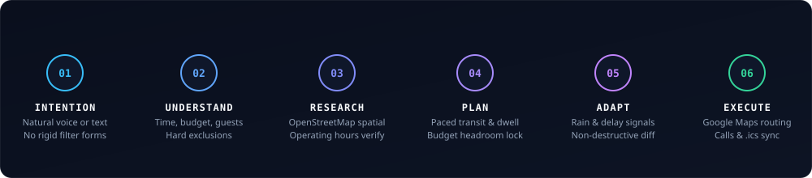
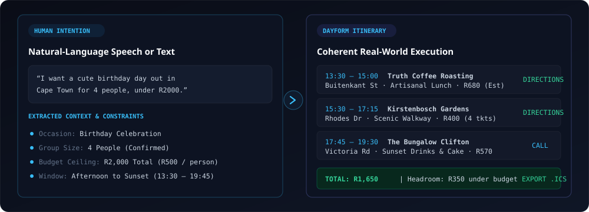
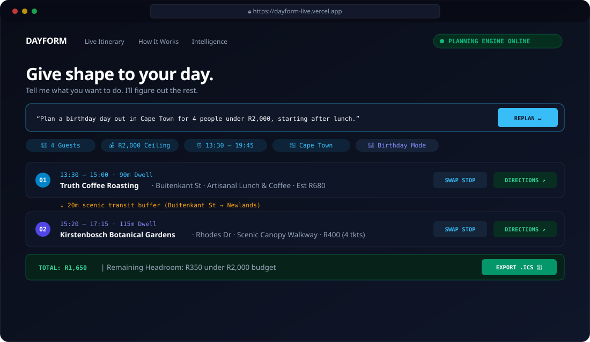
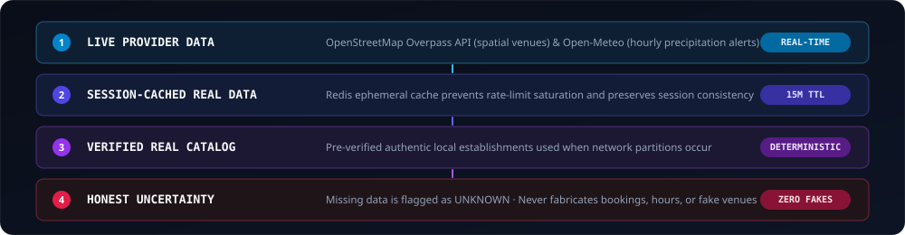
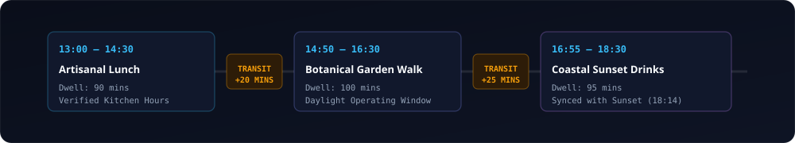
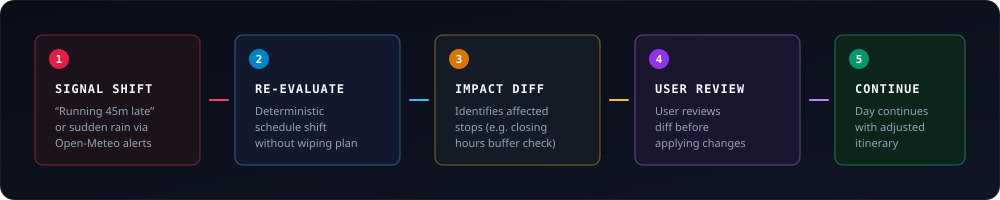
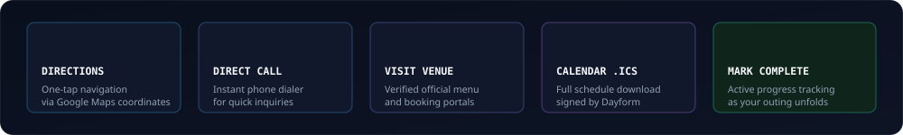
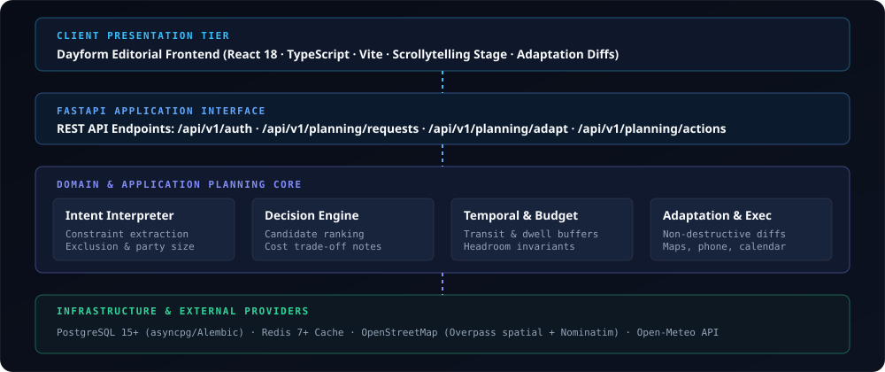

<div align="center">


<br/><br/>

[](https://github.com/SimplyAlice/dayform/actions)
[](https://dayform-live.vercel.app)
[](https://fastapi.tiangolo.com)
[](https://react.dev)
[](https://www.typescriptlang.org)
[](https://www.postgresql.org)
[](LICENSE)

<br/>

### **“Tell me what you want to do. I’ll figure out the rest.”**  
*Give shape to your day.*

<br/>

### **[👉 Try Dayform Live → https://dayform-live.vercel.app](https://dayform-live.vercel.app)**
**[View Source on GitHub → https://github.com/SimplyAlice/dayform](https://github.com/SimplyAlice/dayform)**

<br/>

</div>

---

## What is Dayform?

**Dayform** is an intelligent real-world planning system. It takes an unstructured, natural-language human intention and synthesizes it into an actionable, coherent, budget-aware, and time-sequenced day out.

Whether it is a romantic anniversary dinner, a group birthday celebration, a Saturday cultural outing, an afternoon of self-care, or a spontaneous *"I have R400 and 3 hours in Cape Town, what can I do?"*, Dayform bridges the gap between human intention and physical reality.

### What Dayform is Not

To understand Dayform, it helps to understand what it rejects:

- **Not a restaurant directory**: Directories return thousands of disjointed listings and leave the sequencing, transit math, and timing to you.
- **Not a generic chatbot**: Chatbots hallucinate opening hours, invent addresses, and cannot check if a venue is actually open or accessible.
- **Not a bookmark list**: A collection of saved pins or Instagram saves is not an itinerary. Real plans require chronological sequencing, dwell times, and travel buffers.
- **Not a calendar clone**: Calendars record commitments after you make them. Dayform calculates what is feasible before you commit.

Dayform evaluates real venues, verified operating hours, travel times, group dynamics, and financial constraints to produce **a living, executable plan**.

---

## The Core Loop

Dayform operates through a deterministic six-stage planning lifecycle:

<div align="center">
  
</div>

<br/>

1. **Intention**: Speak or type naturally without filling out rigid dropdown forms.
2. **Understand**: Synthesizes the request into structured constraints, distinguishing hard boundaries (*"no seafood"*, *"strict R500 max"*) from soft aesthetic cues (*"romantic"*, *"casual"*).
3. **Research**: Discovers candidate venues with authentic geographical coordinates, street addresses, and verified operating hours via OpenStreetMap and Overpass.
4. **Plan**: Sequences stops in chronological order, computes travel times and dwell buffers, and validates financial headroom.
5. **Adapt**: When reality shifts (*"We're running 45 minutes late"* or sudden rain), recalculates schedules with non-destructive diffs that preserve unaffected stops.
6. **Execute**: Connects directly to the physical world with one-tap Google Maps routing, venue phone dialing, and `.ics` calendar sync.

---

## From "I want to do something" to an Actual Day

Here is how Dayform transforms an unstructured intention into a verified, sequenced reality:

<div align="center">
  
</div>

<br/>

> **User Intention**:  
> *“I want a cute birthday day out in Cape Town for four people, under R2,000, starting after lunch.”*

### The Transformation:
1. **Understanding**: Identifies a group of 4 guests, extracts an afternoon-to-sunset temporal window (13:30–19:45), applies a strict R2,000 ceiling (R500/person), and sets occasion mode to *Celebration*.
2. **Research**: Queries OpenStreetMap Overpass spatial indexes for Cape Town cafes, scenic outdoor activities, and sunset viewpoints with verified operating hours.
3. **Pacing & Sequencing**: Orders stops logically (Artisanal Lunch → Botanical Canopy Walk → Coastal Sunset Drinks) and inserts realistic 20–25 minute travel buffers.
4. **Budget Invariant Enforcement**: Calculates total estimated spend at **R1,650**, reserving **R350** in transparent financial headroom.
5. **Execution Readiness**: Attaches real GPS coordinates, direct telephone links, and downloadable `.ics` calendar schedules.

---

## Product Experience

The Dayform frontend delivers a cinematic, editorial product experience designed to make planning feel calm, tactile, and intelligent:

<div align="center">
  
</div>

<br/>

- **Conversational Input**: Freeform input with instant syntactic parsing.
- **Candidate Customization**: Browse categorized alternatives for any stop with instant cost trade-off notes before confirming substitutions.
- **Visual Pacing**: Explicit visual transit connectors indicate travel duration between neighborhoods.
- **Execution Bar**: Immediate navigation via Google Maps, phone dialer integration, and calendar sync.

---

## Real-World Intelligence

Dayform is grounded in physical truth. It enforces an explicit four-tier information hierarchy:

<div align="center">
  
</div>

<br/>

### Principles of Grounded Intelligence:
1. **Live Provider Data**: Spatial venue discovery via OpenStreetMap Overpass API and hourly precipitation forecasting via Open-Meteo.
2. **Session-Cached Real Data**: Redis ephemeral caching with 15-minute TTL to protect community API rate limits while ensuring responsive replanning.
3. **Verified Real-World Catalog**: Pre-verified authentic Cape Town venues ensure deterministic availability during upstream network partitions.
4. **Honest Uncertainty**: Missing data is marked as `UNKNOWN`. Dayform never fabricates hours, reservations, or ticket prices. If a venue has no published phone number, it states so honestly.

---

## Temporal Planning & Pacing

A list of places is not a plan. Real outing logistics require temporal reasoning:

<div align="center">
  
</div>

<br/>

Dayform enforces five temporal rules:
- **Operating Hour Invariants**: Stops are scheduled strictly within verified venue hours. Lunch kitchens closing at 15:00 are never assigned a 15:30 arrival.
- **Contextual Dwell Times**: Dwell duration scales realistically by venue type (90m for sit-down dining, 115m for botanical gardens, 45m for artisanal coffee).
- **Geographic Transit Buffers**: Travel times between Cape Town nodes (e.g. City Bowl → Newlands → Clifton) are computed and scheduled as explicit transit stops.
- **Daylight & Golden Hour Alignment**: Scenic and outdoor activities are scheduled around natural light and golden hour milestones.
- **Firm Departure Deadlines**: Hard end constraints (*"must be home by 8pm"*) prevent downstream schedule overrun.

---

## Non-Destructive Adaptation

Plans rarely survive the real world unchanged. When circumstances shift, Dayform adapts dynamically:

<div align="center">
  
</div>

<br/>

### How Adaptation Works:
- **Signal Triggers**: Conversational adjustments (*“Actually, we’re running 45 minutes late”*) or external alerts (incoming rain detected via Open-Meteo).
- **Localized Re-evaluation**: Downstream stops are shifted forward without wiping out unaffected morning or afternoon arrangements.
- **Safety Auditing**: Checks whether shifted arrival times violate venue closing hours.
- **Review Diff**: Dayform presents a clean visual diff highlighting shifted times and proposed substitutions before applying changes.

---

## Real-World Execution Layer

Dayform takes you from recommendation to execution with authentic real-world actions:

<div align="center">
  
</div>

<br/>

| Action | Physical Mechanism | Safety Guarantee |
| :--- | :--- | :--- |
| **📍 Directions** | Exact Google Maps latitude/longitude deep-links | Direct coordinates, never ambiguous search queries. |
| **📞 Direct Call** | Device `tel:` URI trigger | Verified phone numbers from OpenStreetMap community data. |
| **🌐 Visit Venue** | Verified official website / menu URL | Opens official source domain, never affiliate redirect scrapers. |
| **📅 Calendar Export** | Dynamic RFC-5545 `.ics` event file download | Complete timeline export signed: *"Planned with Dayform"*. |
| **✓ Mark Complete** | Client-side progress tracking | Keeps active state synchronized as your day progresses. |

---

## Technical Architecture

Dayform is built on **Clean Architecture** principles, enforcing strict separation between domain logic, application orchestration, and infrastructure adapters:

<div align="center">
  
</div>

<br/>

```text
┌────────────────────────────────────────────────────────────────────────┐
│                        Frontend (React 18 / Vite)                      │
│   Cinematic Scrollytelling · Real-Time Planning Stage · Adaptive Diff  │
└───────────────────────────────────┬────────────────────────────────────┘
                                    │ HTTP / JSON
┌───────────────────────────────────▼────────────────────────────────────┐
│                       FastAPI Application Layer                        │
│        Endpoints: /api/v1/auth · /planning/requests · /adapt · /actions│
└──────────────────┬──────────────────────────────────┬──────────────────┘
                   │                                  │
┌──────────────────▼──────────────────┐   ┌───────────▼──────────────────┐
│        Application Services         │   │      Domain Planning Engine  │
│  Planning · Adaptation · Execution  │   │  Understanding · Decisions   │
│      Live Intelligence Service      │   │  Temporal Logic · Invariants │
└──────────────────┬──────────────────┘   └───────────┬──────────────────┘
                   │                                  │
┌──────────────────▼──────────────────────────────────▼──────────────────┐
│                   Infrastructure & External Providers                  │
│   PostgreSQL 15+ (asyncpg/Alembic) · Redis 7+ · OSM Overpass · Open-Meteo│
└────────────────────────────────────────────────────────────────────────┘
```

---

## Engineering Highlights

- **Deterministic Planning Engine**: Zero reliance on nondeterministic LLM JSON hallucinations for critical logic. Math, travel buffers, and budget calculations are 100% deterministic.
- **Natural-Language Understanding**: Multi-pass intent extractor parsing party sizes, temporal windows, and negative exclusions (*"no outdoors"*, *"not too expensive"*).
- **Spatial Place Index**: Overpass query optimization with geographic bounding boxes for the Cape Town metropolitan area.
- **Non-Destructive Diffs**: Algorithmic itinerary adaptation that calculates minimum edit distances for shifting schedules.
- **Async Python Stack**: Python 3.12 / 3.13, FastAPI, Pydantic v2, SQLAlchemy 2.0 (asyncio + asyncpg), Alembic migrations.
- **Zero-Dependency Responsive Design**: Pure CSS design system with fluid clamp typography, container queries, and full `prefers-reduced-motion` compliance.

---

## Quality & Verified Test Suite

Dayform enforces automated CI verification on every push to `main`:

```bash
# 187 Planning Unit Tests (Domain, Application, Infrastructure)
pytest backend/tests/unit/domain/planning backend/tests/unit/application/planning backend/tests/unit/infrastructure/planning -v
```

| Quality Check | Tool / Engine | Verified Status |
| :--- | :--- | :--- |
| **Backend Unit Tests** | Pytest 8.3 (`asyncio`) | **187 / 187 Passed** (100% pass rate) |
| **Frontend Code Quality** | Oxlint 1.81 | **0 Errors** across 15 files |
| **Production Build** | Vite 8.3 + TypeScript 6.0 | **Compiled in 449ms** (Clean production assets) |
| **Continuous Integration** | GitHub Actions (`Dayform CI`) | **Green / Passing** on `main` |
| **Public Deployment** | Vercel (HTTPS CDN) | **Live & Operational** (`dayform-live.vercel.app`) |

---

## Run Locally

### Prerequisites
- **Python**: 3.12 or 3.13
- **Node.js**: 18+ and `npm`
- **PostgreSQL**: 15+ (local or Docker)
- **Redis**: 7+ (local or Docker)

### 1. Database & Cache Services
```bash
docker compose up -d postgres redis
```

### 2. Backend Setup
```bash
cd backend

# Create and activate virtual environment
python -m venv .venv
# Windows:
.venv\Scripts\activate
# macOS/Linux:
source .venv/bin/activate

# Install dependencies
pip install -r requirements-dev.txt
pip install -e .

# Run database migrations
alembic upgrade head

# Start development server
uvicorn app.main:create_app --factory --host 127.0.0.1 --port 8000 --reload
```
API endpoints will be online at `http://127.0.0.1:8000/` (Interactive OpenAPI docs at `/docs`).

### 3. Frontend Setup
```bash
cd frontend

# Install dependencies
npm install

# Start Vite development server
npm run dev
```
Open `http://localhost:5173/` in your browser.

---

## Project Evolution

This repository reflects an iterative engineering journey across three distinct stages:

```text
CareerOS (Milestones 1–7)          OpsOS (Milestone 8 Working Title)        DAYFORM (Canonical Product)
AI job matching, resume tailoring, ──► Infrastructure orchestration,      ──► Intelligent real-world planning:
and ATS-safe document generation       incident models, and action gates      "Give shape to your day."
```

1. **CareerOS (Milestones 1–7)**: Established clean architecture boundaries, async PostgreSQL migrations, JWT authentication, and AI provider abstractions.
2. **OpsOS (Milestone 8 Exploration)**: Explored deterministic decision engines, event monitoring, and human-in-the-loop action proposals.
3. **Dayform (Canonical Product)**: Synthesized these foundations into an intelligent real-world planning platform that turns human intent into real-world action.

*The underlying PostgreSQL schema history is maintained for architectural continuity.*

---

## License

Dayform is open-source software licensed under the [MIT License](LICENSE).
