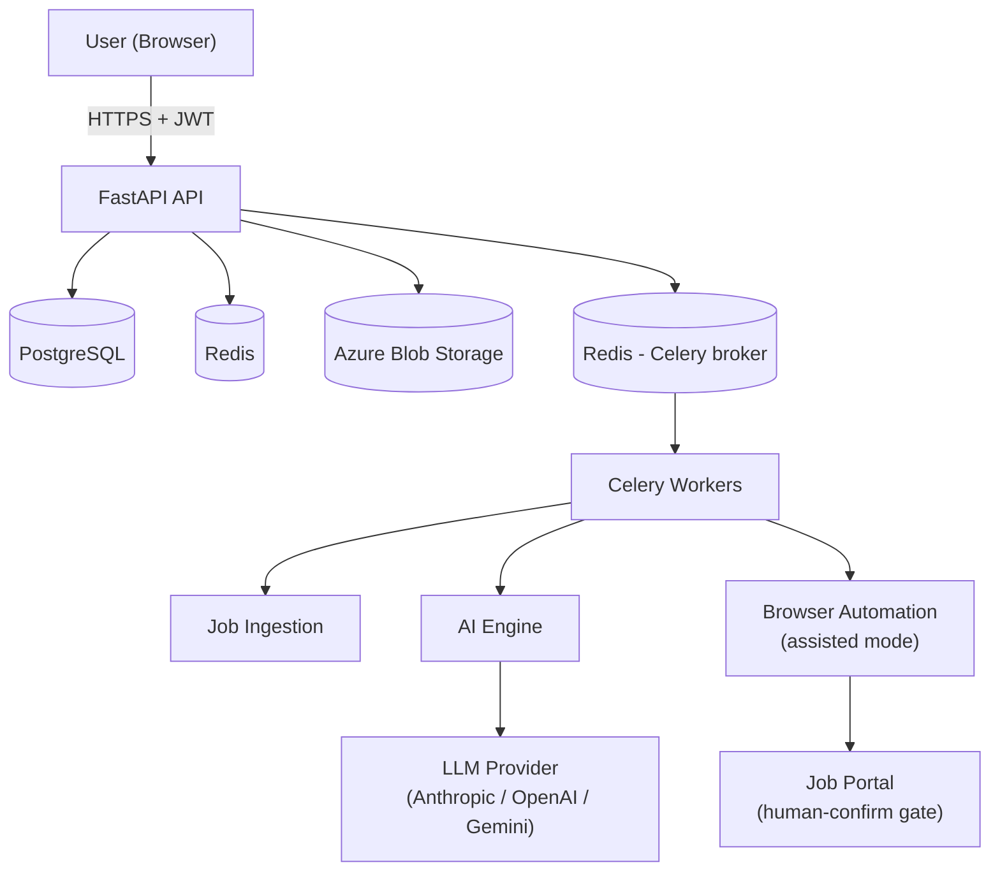

# CareerOS

**An AI-powered career operations platform** — discovers jobs, scores fit
against your profile, tailors resumes and cover letters, and assists with
applications, while keeping a human in control of every irreversible action.


---

## What Is CareerOS?

CareerOS helps a job seeker discover relevant roles from official job-board
APIs, understand how well each one matches their profile via an LLM, generate
tailored application materials, and track every application in one place —
without ever silently acting on their behalf under their real identity.

## Why It Exists

Most "auto-apply" tools either violate job boards' Terms of Service outright,
or blast out generic, unreviewed applications. CareerOS is built on the
opposite premise: **automation should remove repetitive work, not judgment.**
Every AI-generated document and every automated form-fill stops at a human
confirmation step by default. Full autonomous submission is available but is
an explicit, off-by-default, per-portal opt-in — see
[`docs/adr/0009-human-in-the-loop-automation.md`](docs/adr/0009-human-in-the-loop-automation.md)
for the full reasoning.

## Architecture Overview



Full architecture documentation, including request-flow, deployment, database,
security, and observability diagrams, lives in [`docs/architecture/`](docs/architecture/).

## Technologies

Python · FastAPI · SQLAlchemy · PostgreSQL · Redis · Celery · React ·
TypeScript · Tailwind CSS · Docker · Playwright · Azure (App Service,
Container Apps, ACR, Managed PostgreSQL, Blob Storage, Key Vault, Application
Insights) · Bicep · GitHub Actions

Full justification for every choice, including alternatives considered and
trade-offs: [`docs/portfolio/tech-stack.md`](docs/portfolio/tech-stack.md).

## Documentation

| Folder | Contents |
|---|---|
| [`docs/architecture/`](docs/architecture/) | System design, high-level architecture, deployment, cloud, API, AI, browser automation, observability, security, and database design — with diagrams |
| [`docs/adr/`](docs/adr/) | Architecture Decision Records — every significant technical choice, with alternatives and consequences |
| [`docs/roadmap/`](docs/roadmap/) | Milestones, risks, and the project's development process |
| [`docs/portfolio/`](docs/portfolio/) | Recruiter/hiring-manager-facing overview, tech stack summary, key engineering decisions, lessons learned, and future roadmap |

## Setup Instructions

> Milestones 1–6 are complete: FastAPI + PostgreSQL + Redis, job ingestion
> from Adzuna, profile management, AI-powered job scoring, and AI-generated
> resume/cover-letter PDFs (Anthropic) all run together via one Docker
> Compose command. There's still no auth — CareerOS supports exactly one
> local profile until JWT auth lands (see
> `docs/adr/0012-profile-management.md`). The frontend hasn't been started
> (planned for Milestone 7).

```bash
git clone https://github.com/<your-username>/careeros.git
cd careeros
cp .env.example .env
# Edit .env — at minimum set SECRET_KEY to a real generated value:
#   python -c "import secrets; print(secrets.token_urlsafe(64))"
docker compose up --build
```

Then visit:
- **API root**: `http://localhost:8000/` — basic service info
- **Health check**: `http://localhost:8000/api/v1/health`
- **Interactive API docs (Swagger)**: `http://localhost:8000/docs`
- **List jobs**: `GET http://localhost:8000/api/v1/jobs`
- **Ingest jobs**: `POST http://localhost:8000/api/v1/jobs/ingest` with body `{"query": "cloud engineer", "location": "Cape Town"}` — requires `ADZUNA_APP_ID`/`ADZUNA_APP_KEY` in `.env` (free at https://developer.adzuna.com); returns `503` if unset.
- **Profile**: `GET`/`POST`/`PATCH http://localhost:8000/api/v1/profile` — a single local profile (no auth yet, see `docs/adr/0012-profile-management.md`); `POST` returns `409` if one already exists, `GET`/`PATCH` return `404` if none exists yet.
- **Score a job**: `POST http://localhost:8000/api/v1/matches` with body `{"job_id": "<uuid>"}` — scores the profile against a job using Claude, requires `ANTHROPIC_API_KEY` in `.env` (get one at https://console.anthropic.com); returns `503` if unset, `502` if the model's response can't be parsed, `404` if the profile or job doesn't exist.
- **List matches**: `GET http://localhost:8000/api/v1/matches`
- **Generate a resume**: `POST http://localhost:8000/api/v1/resumes/generate` with body `{"job_id": "<uuid>"}` (or `{}` for a general resume) — requires `ANTHROPIC_API_KEY`; returns `502` if the model's response can't be parsed.
- **List/download resumes**: `GET http://localhost:8000/api/v1/resumes` and `GET http://localhost:8000/api/v1/resumes/{id}/download`
- **Generate a cover letter**: `POST http://localhost:8000/api/v1/cover-letters/generate` with body `{"job_id": "<uuid>"}` (required — cover letters are always job-specific)
- **List/download cover letters**: `GET http://localhost:8000/api/v1/cover-letters` and `GET http://localhost:8000/api/v1/cover-letters/{id}/download`

### Running backend tests locally (without Docker)

```bash
cd backend
python -m venv .venv && source .venv/bin/activate
pip install -r requirements-dev.txt
pytest -v
ruff check app tests
black --check app tests
mypy app
```

Integration tests (`tests/integration/`) run against a real PostgreSQL
database — set `DATABASE_URL` to point at one (the `docker compose`
Postgres service works: `postgresql+asyncpg://careeros:<password>@localhost:5432/careeros`).
They create and drop their own tables per test, so a disposable/dev
database is fine; don't point this at a database with data you care about.

### Database migrations

```bash
cd backend
alembic upgrade head          # apply all migrations
alembic downgrade base        # roll back everything
alembic revision --autogenerate -m "description"   # generate a new migration after model changes
```

### Backend folder structure

```
backend/
├── app/
│   ├── domain/            # Entities & business rules — empty until Milestone 2+
│   ├── application/       # Use-case services — empty until Milestone 2+
│   ├── infrastructure/    # DB session, Redis client, (later) AI/automation/storage adapters
│   ├── api/               # FastAPI routers (v1/health.py) and shared dependencies (deps.py)
│   ├── workers/           # Celery task definitions — added in Milestone 8
│   ├── core/              # Settings (config.py) and structured logging (logging.py)
│   └── main.py            # Application factory + startup/shutdown lifecycle
├── alembic/               # Migration environment — first real migration lands in Milestone 2
├── tests/
│   ├── unit/              # test_health.py, test_startup.py
│   └── integration/       # Added once real DB-backed repositories exist
├── Dockerfile
├── pyproject.toml         # ruff / black / pytest / mypy configuration
├── requirements.txt       # Runtime dependencies
└── requirements-dev.txt   # + testing/linting/formatting tools
```

Full reasoning behind this layout: [`docs/architecture/repository-structure.md`](docs/architecture/repository-structure.md).

## Roadmap

CareerOS is being built incrementally and publicly, one milestone at a time.
See [`docs/roadmap/milestones.md`](docs/roadmap/milestones.md) for the full
14-milestone plan, from the backend skeleton through Azure deployment and
analytics.

| Milestone | Status |
|---|---|
| 0 — Foundations & architecture | ✅ Complete |
| 1 — Core backend skeleton | ✅ Complete |
| 2 — Database schema | ✅ Complete |
| 3 — Job ingestion | ✅ Complete |
| 4 — Profile management | ✅ Complete |
| 5 — AI scoring engine | ✅ Complete |
| 6 — Resume/cover letter generation | ✅ Complete |
| 7 — React dashboard v1 | ⏳ Up next |
| 8–14 | 📋 Planned |

## Screenshots

*Coming soon — screenshots will be added starting Milestone 6 (React
dashboard v1).*

## Deployment

*Coming soon — a live staging environment link will be added starting
Milestone 12 (Azure deployment). Deployment architecture is fully documented
now in [`docs/architecture/deployment-architecture.md`](docs/architecture/deployment-architecture.md).*

## Contributing

This is currently a solo portfolio project built milestone-by-milestone in
the open. It isn't accepting external contributions at this stage, but
issues/discussion around the architecture and design decisions are welcome —
see [`docs/adr/`](docs/adr/) for the reasoning behind current choices before
suggesting a change.

## License

[MIT](LICENSE)
