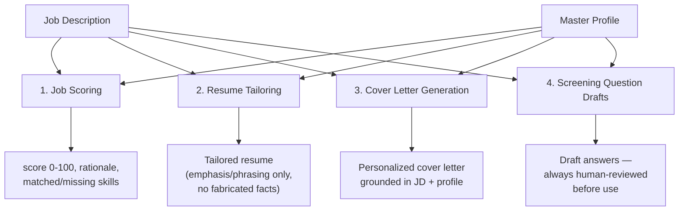

# AI Architecture

## 1. Provider Abstraction

```python
class LLMProvider(Protocol):
    async def complete(
        self, *, system: str, prompt: str,
        response_format: type[BaseModel] | None = None,
    ) -> str: ...

class AnthropicProvider(LLMProvider): ...
class OpenAIProvider(LLMProvider): ...   # added later, same interface
class GeminiProvider(LLMProvider): ...   # added later, same interface
```

Application services (scoring, resume tailoring, cover letters) depend on
`LLMProvider`, never on a concrete SDK. Provider selection is a config value
(`AI_PROVIDER=anthropic`), resolved once at startup via a factory function.
This is the **Strategy pattern** — swap an implementation without touching the
client code — applied to the one part of the system most likely to change
providers over the project's life (pricing, capability, or availability
shifts).

## 2. AI Use Cases

Each use case below is its own application service with its own prompt
template and its own Pydantic response schema — not one giant do-everything
prompt. This keeps failures isolated (a bad cover-letter prompt doesn't affect
scoring) and keeps each prompt testable independently.



1. **Job Scoring** — structured output enforced via a Pydantic response
   schema, so downstream code never parses free text out of a model response.
2. **Resume Tailoring** — restructures the master profile to emphasize
   relevant experience for a specific job. Explicit system-prompt constraint
   and a v1 review rule: the AI adjusts emphasis and phrasing, **never
   fabricates experience** the user didn't provide.
3. **Cover Letter Generation** — grounded in company name, role, and 2–3
   explicit points pulled from the job description plus the master profile —
   not generic filler text.
4. **Screening Question Answers** — draft answers to common questions ("Why
   this company," "Describe a challenge"), always presented for user edit and
   approval, never auto-submitted verbatim.

## 3. Memory

"AI memory" here means **structured retrieval from Postgres**, not a
vector-store chat history. Before scoring or generating, the service loads the
user's past applications, resumes used, and outcomes, and includes relevant
summaries in the prompt context (e.g. "user already applied to this company
for a similar role on {date}"). A semantic/embedding-based memory layer
(pgvector) is a documented **stretch goal** for later, once the structured
version is proven — it is not required to satisfy FR-18.

## 4. Guardrails

- Every AI-generated resume/cover letter/answer is a **draft** — presented for
  human review before it's used anywhere, never auto-submitted as-is.
- System prompts explicitly instruct the model not to invent employers, dates,
  titles, or metrics not present in the master profile.
- Structured output (Pydantic schema validation) rejects malformed model
  responses before they reach the database — a response that doesn't parse
  triggers a retry, not a silently-corrupted record.
- `ai_conversations` table stores prompt/response summaries for every
  generation, giving an audit trail for "why did the system suggest this" —
  useful both for debugging and for demonstrating responsible AI practice in
  a portfolio review.
