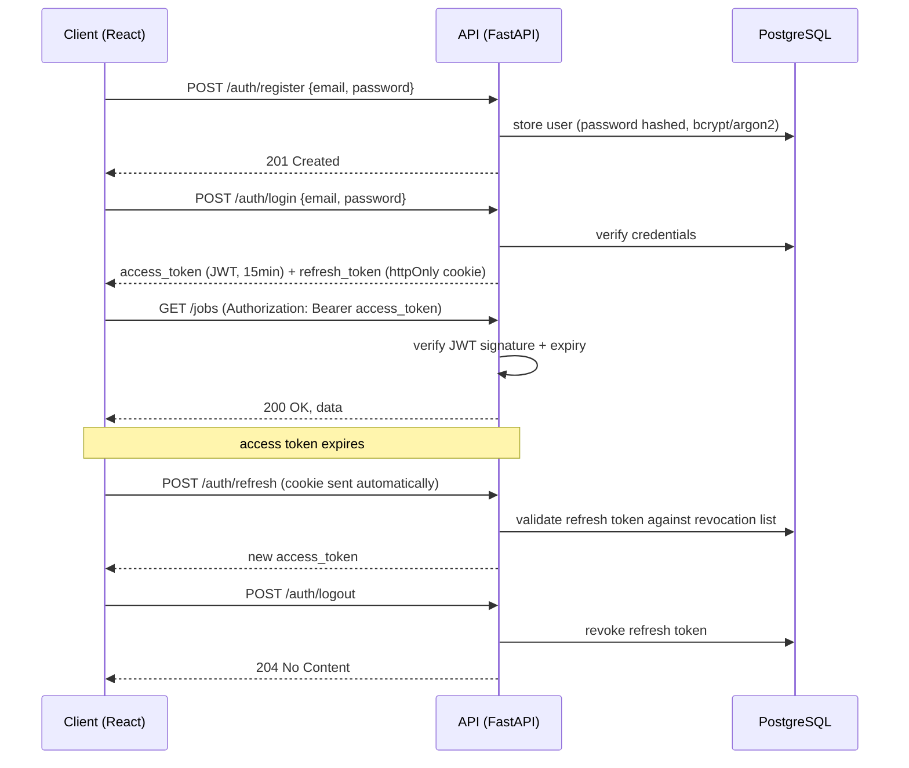
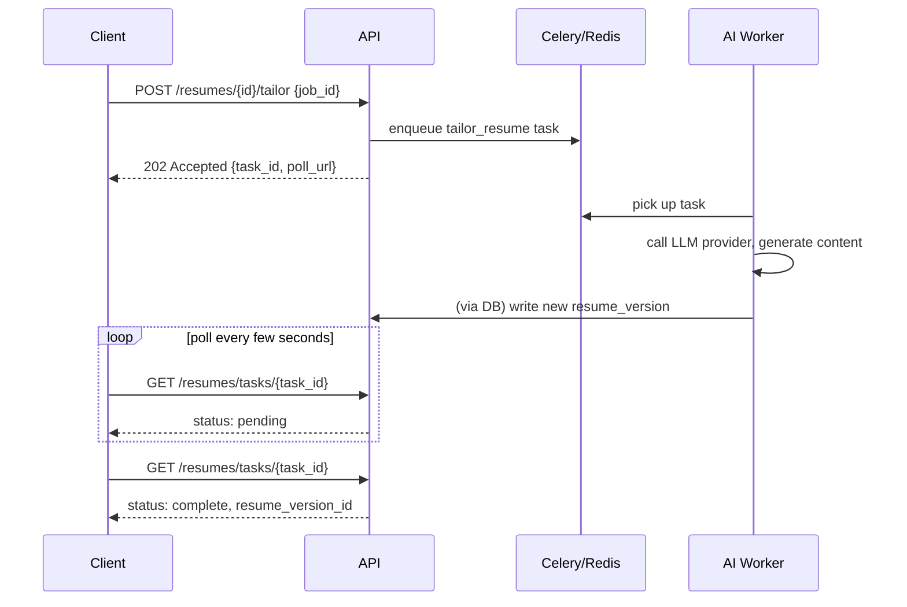

# API Design

## 1. Conventions

- REST over `/api/v1/...`, versioned from day one — cheap now, painful to
  retrofit once a frontend depends on unversioned routes.
- Resource-oriented routes: `/jobs`, `/applications`, `/resumes`, `/matches` —
  not RPC-style `/getApplications`.
- Pydantic schemas separate **input** (`ApplicationCreate`) from **output**
  (`ApplicationRead`) — the API never returns ORM objects directly, which
  prevents accidental over-exposure of internal fields (e.g. hashed passwords,
  internal foreign keys not meant for the client).
- Cursor-based pagination (`?cursor=...&limit=...`) on list endpoints — stable
  under concurrent inserts (new jobs arriving mid-page), unlike offset
  pagination which can skip or duplicate rows.
- Long-running operations (AI generation, automation runs) return `202
  Accepted` plus a resource URL to poll (`/automation-runs/{id}`) — never a
  blocking response. This mirrors how async operations are modeled in mature
  public APIs (e.g. Stripe, GitHub Actions).
- OpenAPI docs auto-generated by FastAPI at `/docs` in dev; disabled or
  auth-gated in production.

## 2. Authentication Flow

Refresh tokens are stored **hashed** in the DB with a revocation list, so a
stolen refresh token can be invalidated server-side (logout-everywhere,
forced invalidation on password change) — a plain JWT-only scheme without a
DB-backed revocation mechanism can't do this.

## 3. Authorization

- Role field on `users` (`user`, `admin`), enforced via a FastAPI dependency
  (`require_role("admin")`) at the route level — a real, demonstrable RBAC
  pattern even though v1 doesn't have much admin-only functionality yet.
- Resource ownership checks (a user can only read/modify their own
  applications/resumes) enforced in the application service layer, not just
  trusted from the URL — every query is scoped by `user_id` from the verified
  JWT, never from a client-supplied parameter.

## 4. Rate Limiting

- Stricter limits on `/auth/login` and `/auth/register` specifically (vs.
  general API limits) to blunt credential-stuffing and account-enumeration
  attempts.
- Separate limits on AI-generation endpoints — this is as much cost control
  (LLM API calls have a real dollar cost per request) as it is abuse
  prevention.

## 5. Async Operation Pattern (example: resume tailoring)

