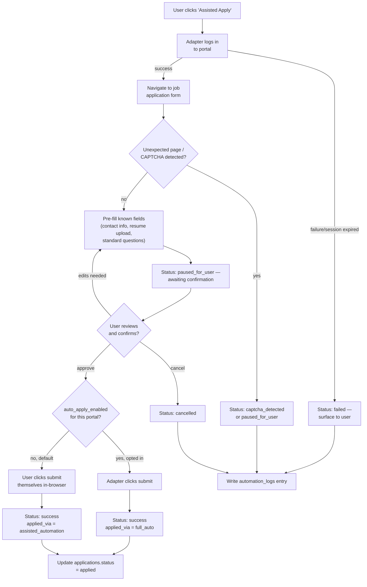

# Browser Automation Architecture

## 1. Principles

- **Assisted, not autonomous, by default.** The automation task fills the
  form and stops before the final submit action. A per-user
  `settings.auto_apply_enabled` flag (default `false`) can allow full
  auto-submit for a specific portal the user has explicitly opted into — and
  every such submission is tagged `applied_via = full_auto` in the
  `applications` table for auditability.
- **Portal-by-portal support, not a universal scraper.** Each supported portal
  gets its own adapter class implementing a common `PortalAutomation`
  interface (`login`, `search`, `fill_application`, `submit`). Adding a new
  portal means writing one adapter, not touching orchestration logic.
- **Failure is a first-class outcome, not an exception to hide.** Timeouts,
  CAPTCHA detection, and unexpected DOM states all resolve to a visible
  `automation_runs.status` value the user can see and act on
  (`paused_for_user`, `captcha_detected`, `failed`) — never a silent retry
  loop against a site that's actively blocking automation.
- **Credentials for target portals** are stored encrypted (Key Vault-backed or
  encrypted-at-rest column — finalized in the Milestone 7 implementation),
  never logged, and never passed through the AI layer.

## 2. Workflow

## 3. Why This Is Safer Than It Sounds

Because the highest-risk action (final submission) always requires a live
human click by default, CareerOS's worst-case failure mode is "the user has
to finish clicking submit themselves" — not "the system did something to
their account they didn't want." That's the entire design philosophy behind
FR-16, and it's the answer to give if an interviewer asks "how do you know
this doesn't get someone's LinkedIn account banned."

## 4. Handling Fragility

Portal DOMs change. The mitigation isn't "write more robust selectors and
hope" — it's architectural:

- Each portal adapter is small and isolated, so a breakage is a one-file fix,
  not a system-wide outage.
- Adapter-level tests run against saved HTML fixtures (captured page
  snapshots), so selector regressions are caught in CI before they hit a real
  application attempt.
- `automation_logs` captures a step-by-step trail (which selector was sought,
  what was found instead) specifically so a breakage is diagnosable from logs
  rather than requiring live reproduction.
