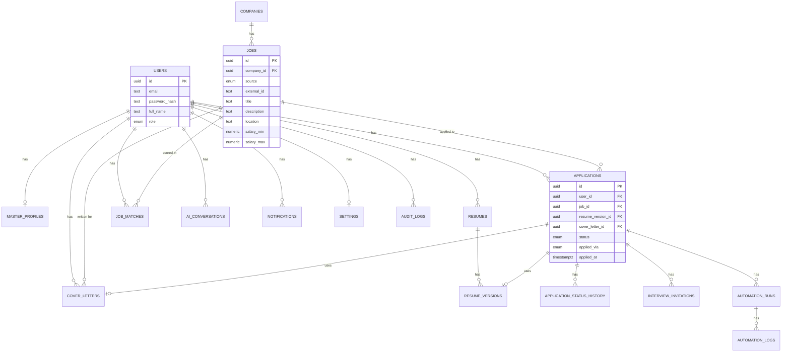

# Database Design

## 1. Entity Relationship Diagram

*Unique constraint `(user_id, job_id)` on `APPLICATIONS` is the enforced
duplicate-application guard (FR-14) — noted here since it doesn't render in
the diagram itself.*

## 2. Table Reference

### `users`
Auth identity + profile root. `password_hash` — bcrypt/argon2, never
plaintext. `role` seeds RBAC for future multi-tenant use.

### `master_profiles`
1:1 with `users`. The canonical source resumes are generated *from*.
`structured_data` (JSONB): experience, education, skills, projects.

### `companies`
`name`, `website`, `industry`, `size`.

### `jobs`
`source` (adzuna/greenhouse/lever/manual), `external_id` — **unique
constraint on `(source, external_id)`** prevents duplicate ingestion of the
same posting across ingestion runs.

### `job_matches`
Decoupled from `jobs` deliberately: `score`, `rationale`, `model_used`. A job
can be re-scored (profile changes, model changes) without mutating the
immutable ingested job record, and score history over time becomes queryable.

### `resumes` / `resume_versions`
`resumes` = a named variant lineage (e.g. "Cloud Resume"). `resume_versions` =
each generated/edited iteration, **immutable once created**. An `Application`
references a specific version at time of applying — if the profile is later
edited, past applications still show exactly what was actually sent. This
mirrors how real ATS/document systems (e.g. Greenhouse itself) version
documents, and it's both good audit practice and a real requirement (you need
to know what a recruiter actually received).

### `cover_letters`
Content, associated job, rendered PDF blob reference.

### `applications`
The central tracking entity. `status` enum drives the Applications page.
`applied_via` (manual / assisted_automation / full_auto) is the audit trail of
*how* a submission happened — directly supporting the human-in-the-loop
design principle. **Unique constraint `(user_id, job_id)`** is the actual
mechanism behind "avoid duplicate applications" (FR-14), enforced at the
database level so it holds even under concurrent requests, not just trusted to
application code.

### `application_status_history`
Append-only log of status transitions — this is what powers the Applications
timeline view and the interview-rate / response-rate analytics.

### `interview_invitations`
`scheduled_at`, `interview_type`, `recruiter_name`, `notes`.

### `ai_conversations`
Stores prompt/response *summaries* for every AI generation (scoring, resume
tailoring, cover letter, screening answers) — an audit/debug trail, not a raw
chat log with the user.

### `automation_runs` / `automation_logs`
`automation_runs` = one Playwright session attempt (`status`: success,
failed, paused_for_user, captcha_detected). `automation_logs` = the
step-by-step event trail within it, used for debugging portal breakages.

### `notifications`
Channel (email/discord), subject, body, sent status.

### `settings`
Per-user config: notification preferences, AI provider preference,
`auto_apply_enabled` (defaults false), score alert threshold.

### `audit_logs`
Security-relevant events only (login, password change, settings change, data
export/delete) — append-only, access-restricted, kept separate from
operational/automation logs (see `architecture/observability.md` §7).

## 3. Key Design Decisions

- **Why JSONB for `structured_data` / resume `content`?** Resume content is
  semi-structured and will iterate quickly during early development; JSONB
  gives schema flexibility without a NoSQL database, while Postgres still lets
  us index into it (`GIN` index) if a query pattern demands it later.
- **Why is `job_matches` its own table instead of columns on `jobs`?** Scores
  are user-specific and model-specific — a column on `jobs` couldn't represent
  "this job scores 82 for User A and 45 for User B."

Full SQLAlchemy models and the first Alembic migration are produced in
**Milestone 2** — this document fixes the *shape*, not the implementation.
