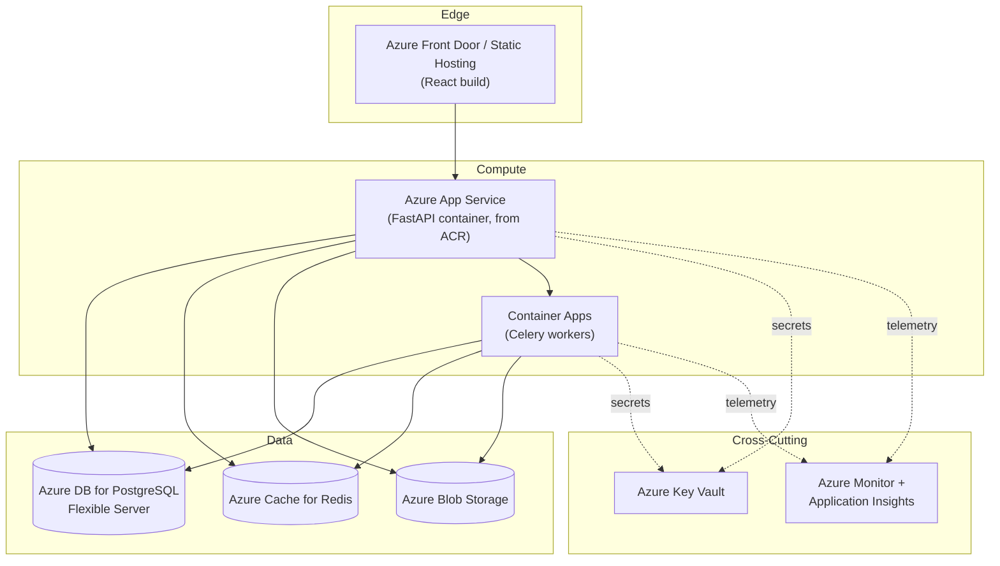
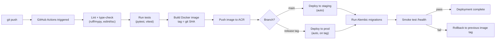

# Deployment Architecture

## 1. Deployment Topology

## 2. CI/CD Pipeline

## 3. Environments

| Environment | Trigger | Purpose |
|---|---|---|
| **dev** | Local `docker-compose up` | Day-to-day development, hot reload |
| **staging** | Merge to `main` | Integration testing against real Azure services, pre-prod validation |
| **prod** | Tagged release (`v*`) | The live, demoable environment linked from the portfolio README |

Staging and prod use **separate Azure resource groups and separate Key
Vaults**, so a staging misconfiguration can never touch production secrets.

## 4. Rollback Strategy

- Container images are immutable and tagged by git SHA — rollback means
  redeploying the previous tag, not rebuilding.
- Database migrations are written to be backward-compatible for at least one
  release: additive changes (new nullable columns, new tables) ship first;
  destructive changes (dropping/renaming columns) ship in a following release
  once nothing references the old shape. This means a code rollback never
  requires an accompanying DB rollback.
- Smoke test (`/health` returning 200 post-deploy) gates whether a deploy is
  considered successful; a failed smoke test triggers an automatic redeploy of
  the last known-good image tag.

## 5. Scaling Path (documented, not implemented in v1)

| Trigger | Response |
|---|---|
| API CPU/memory consistently > 70% | Scale out App Service plan (more instances) — stateless API design (JWT, no server-side session) makes this a no-code change |
| Celery task queue depth growing faster than it drains | Scale out Container Apps worker replica count |
| Postgres connections saturating | Introduce PgBouncer connection pooling before vertically scaling the DB tier |
| Redis memory pressure from cache growth | Split cache and broker into separate Redis instances |

This table exists so scaling is a **documented, deliberate decision** made
when a real signal appears — not guessed at upfront (premature scaling adds
cost and complexity with no evidence it's needed yet).
