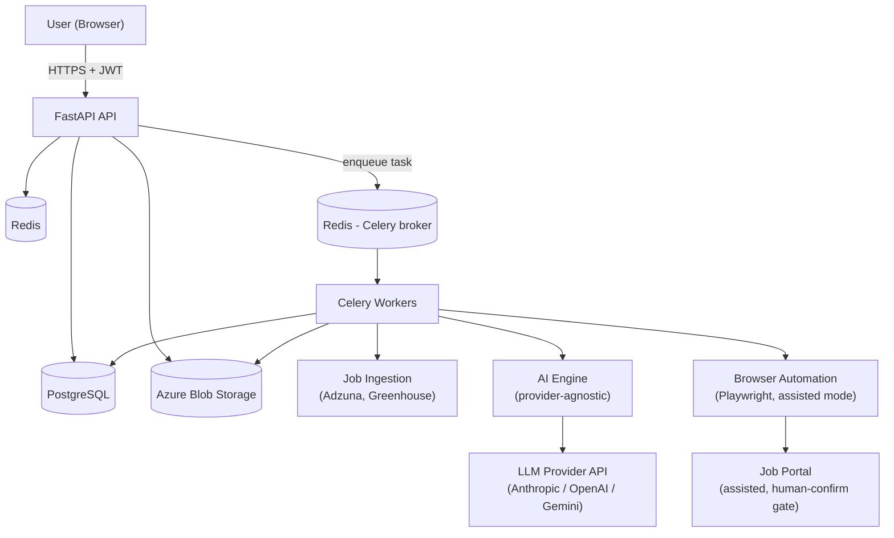
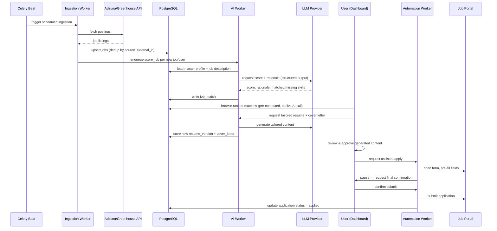

# High-Level Architecture

## 1. System Context



## 2. Component Responsibilities

| Component | Responsibility | Why it's separate |
|---|---|---|
| **API layer** (FastAPI) | Auth, validation, CRUD, orchestration entry points | Kept thin and synchronous; never blocks on AI calls or browser automation |
| **Celery workers** | Long-running/async work: scraping, AI scoring, resume generation, automation | These take seconds-to-minutes; running them in-request would exhaust API workers and time out clients |
| **PostgreSQL** | Durable system of record | Relational integrity matters — an Application must reference a real Job and a real Resume version |
| **Redis** | Celery broker + result backend, short-lived caching | Purpose-built for queues; decouples task dispatch from execution |
| **Azure Blob Storage** | Binary artifacts (generated PDFs, uploads) | Databases are poor at large binaries; blob storage scales independently and is cheaper |
| **AI Engine** | Provider-agnostic interface over LLM calls | Swapping OpenAI/Anthropic/Gemini should mean swapping one adapter, not rewriting business logic |
| **Browser Automation** | Playwright-driven form-fill, human-confirm gate | Isolated because it's the most fragile component and should never block core app functionality if it breaks |

## 3. Why This Shape (and not simpler)

**Why not just FastAPI + Postgres, no queue?** AI calls (seconds) and browser
automation (many seconds to minutes) would block API request threads and time
out the frontend. A queue-backed worker model is the standard pattern for
slow, unreliable external calls in production systems — the same reason
Stripe, GitHub, and most SaaS products push PDF generation, emails, and
webhook delivery onto background workers instead of the request path.

**Why Redis for both cache and broker?** At this scale one instance serves
both roles without contention. Splitting them is a scaling decision reserved
for later — noted as a documented trigger condition rather than implemented
prematurely (see the YAGNI framing in `adr/0004-redis-celery.md`).

**Why wall off Browser Automation as its own worker pool?** Playwright
processes are heavy (full browser instances), and portal selectors are the
most likely part of the system to break when a job site changes its DOM.
Isolating it means the core app (auth, matching, tracking) stays fully
functional even if a specific portal's automation breaks.

## 4. Request Flow — "Find and Tailor a Job" (happy path)



## 5. Module Boundaries (Clean Architecture, applied pragmatically)

```
app/
  domain/         # Entities & business rules — no framework imports
  application/    # Use cases / services — orchestrate domain + ports
  infrastructure/ # Adapters — DB (SQLAlchemy), AI providers, Playwright, Blob
  api/            # FastAPI routers — thin, translate HTTP <-> use cases
  workers/        # Celery task definitions — thin, call application services
```

The rule: `domain/` never imports from `infrastructure/` or `api/`.
Dependencies point inward — this is what lets us swap Postgres, or OpenAI for
Anthropic, by changing an adapter, not the business logic. This is applied
only at boundaries that actually change (AI provider, job source, DB) — not
layered everywhere out of dogma.
